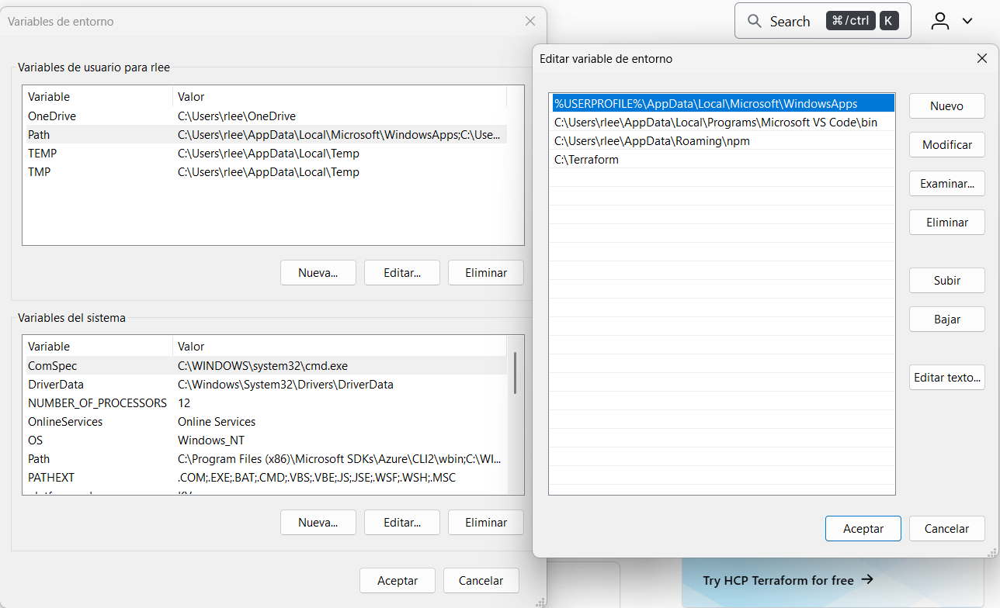

# Ejercicio 01

## Objetivos

- Tener un primer contacto con Terraform.
- Configurar proveedor de azure para utilizar un Service Principal.

## Pre-requisitos

- Disponer de los siguientes recursos:
  - Subscripción de Azure.
  - Azure KeyVault.
  - Service Principal en Azure.

## Enunciado

Documenta este ejercicio dando una breve explicación (una línea) de cada uno de los pasos del proceso.

Sigue los puntos del siguiente [Tutorial Guiado][GuidedDoc], intercambiando la creación del service principal por cómo rescatar sus valores usando azure cli. (Recuerda ocultar los valores sensibles en las capturas de pantalla).

[GuidedDoc]: https://developer.hashicorp.com/terraform/tutorials/azure-get-started/azure-build

Si fuera necesario desplegar algún recurso, al finalizar el ejercicio recuerda ejecutar el comando `terraform destroy` para eliminar todos los recursos creados y puedas empezar en el siguiente ejercicio sin conflictos de recursos preexistentes.

## Entregables

**IMPORTANTE:** ¡Cuidado con exponer los valores sensibles!

- Documentación del proceso (con capturas de pantalla).
- Código de Terraform utilizado (como un directorio propio dentro del entregable).

## Proceso

**Instalación de Terraform**: 

Para instalar Terraform nos dirigimos a su pagina oficial desde el siguiente enlace [Terraform Install](https://developer.hashicorp.com/terraform/install). Debemos descargar la versión correspondiente a nuestro sistema operativo en mi caso me instalé la versión de Windows AMD64 y el contenido del zip lo descomprimí en la carpeta `C:Terraform`. 


Luego añadímos la ruta `C:\Terraform` a la variable de entorno `PATH` para poder ejecutar el comando `terraform` desde cualquier directorio.



Si ahora usamos el comando `terraform -v` podemos ver la versión instalada.


Ahora que lo añadimos debemos instalar el CLI de Azure y para hacerlo seguimos el tutorial de [Azure CLI Install](https://developer.hashicorp.com/terraform/tutorials/azure-get-started/azure-build). El tutorial nos dice que debemos instalar el CLI de Azure y para ello debemos ejecutar el siguiente comando:

```bash
Invoke-WebRequest -Uri https://aka.ms/installazurecliwindows -OutFile .\AzureCLI.msi; Start-Process msiexec.exe -Wait -ArgumentList '/I AzureCLI.msi /quiet'; rm .\AzureCLI.msi
```

Este comando comenzará a descargar Azure CLI.


Una vez descargado simplemente debemos iniciar sesión y lo haremos usando el siguiente comando:

```bash
az login
```

Nos preguntará que cuenta queremos usar en mi caso usaré la cuenta de Microsoft de Stemdo.


Cuando escojamos la cuenta nos preguntará la suscripción que deseamos usar, en mi caso usaré la que me ofrece Stemdo.


Ahora para rescatar los valores del Service Principal debemos ejecutar el siguiente comando:

```bash
# Con este comando podemos rescatar el nombre de nuestro SP y el ID
az ad sp list --all --query "[?starts_with(displayName, 'sp-')].displayName" -o table


# Con este comando podemos rescatar el Tenant ID
az account show --query tenantId -o tsv

# Con este comando podemos rescatar el ID de la subscripción
az account show --query id -o tsv
```

El cliente secreto lo sacamos dirigiendonos a nuestro Grupo de Recursos, luego a Azure Key Vault, luego objetos y en secretos escogemos el de nuestro Service Principal y veremos una key hacemos clic en ella y nos abriran las propiedades y valores de la key.


Luego de definirlas podemos verlas con el comando: 

```powershell
# Nos permite ver las variable de entorno filtrandolas por aquellas que empiecen por ARM_
Get-ChildItem Env: | Where-Object { $_.Name -like "ARM_*" }
```

