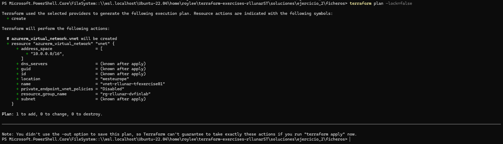
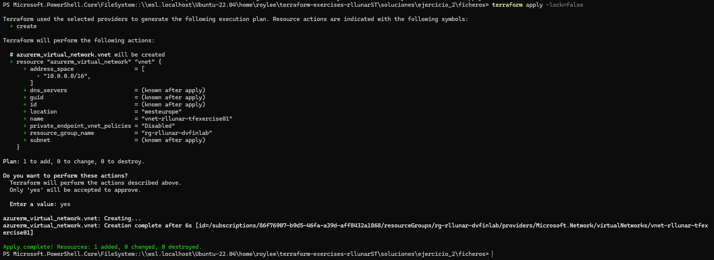
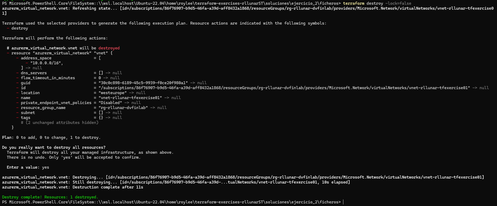

# Ejercicio 02

## Objetivo

- Parametrizar un módulo raíz básico de Terraform.
- Introducción al uso de bloques "data" en Terraform.

## Pre-requisitos

- Disponer de un `resource group` en Azure sobre el que poder desplegar los recursos de este ejercicio.

## Enunciado

Desarrolla un módulo de terraform que permita desplegar una Virtual Network (VNet) sobre un Resource Group pre-existente en Azure. Para esto, crea los ficheros:

- `main.tf`, para los recursos terraform.
- `variables.tf`, para la definición de las variables de entrada.
- `terraform.tfvars`, para los valores de las variables de entrada.

El módulo debe contener una parametrización adecuada para aceptar el contenido del siguiente fichero `terraform.tfvars` (adapta los valores entre los símbolos `< >`):

```hcl
existent_resource_group_name = "<nombre_de_un_rg_ya_existente>"
vnet_name = "vnet<tunombre>tfexercise01"
vnet_address_space = ["10.0.0.0/16"]
```

Además debe existir una variable adicional, `location`, que permita indicar la localización donde se desplegará la VNet. Si no se especifica su valor en el tfvars, se debe utilizar `West Europe` por defecto.

Despliega el recurso en Azure utilizando el módulo desarrollado, documentando el proceso en el entregable.

Al finalizar el ejercicio, ejecuta el comando `terraform destroy` para eliminar todos los recursos creados y puedas empezar en el siguiente ejercicio sin conflictos de recursos preexistentes.

## Entregables

**IMPORTANTE:** ¡Cuidado con exponer los valores sensibles!

- Documentación del proceso (con capturas de pantalla).
- Código de Terraform utilizado (como un directorio propio dentro del entregable).

## Proceso

Para realizar este ejercicio, he creado un fichero `main.tf` donde en el debemos identificar el proveedor con el que vamos a trabajar en este caso `azurerm` y el recurso que vamos a crear que es una `virtual_network`.

Luego tenemos que definir el recurso que vamos a crear, en este caso indicamos que el recurso que necesitamos es un `azurerm_virtual_network` osea una red virtual de Azure. Luego especificamos el nombre que debe tener dentro de terraform que es `vnet` y dentro definimos los campos que necesitará nuestro recurso que son el nombre de la red virtual, la localización donde se va a desplegar, el nombre del grupo de recursos existente y el espacio de direcciones que tendrá la red virtual. Por ultimo definiremos un tag con la inteción de poder identificar el recurso cuando los creemos, podemos observar que el resultado final es el siguiente:

```h
provider "azurerm" {
  features {}
}

resource "azurerm_virtual_network" "vnet" {
  name                = var.vnet_name
  location            = var.location
  resource_group_name = var.existent_resource_group_name
  address_space       = var.vnet_address_space

  tags = {
    environment = "Ejercicio 1 - RLLM"
  }
}
```

Con esto ya habremos definido el modulo y sus parametro ahora debemos definir sus variables para ello crearemos un fichero `variables.tf` donde definiremos las variables de entrada para el modulo y su descripcion, lo que haremos es definir todas las variables que hemos utilizado en el fichero `main.tf` junto a su tipo de dato, descripción y valor por defecto (en el caso de la variable location), el resultado será el siguiente:

```h
variable "existent_resource_group_name" {
  description = "Nombre del Resource Group ya existente en Azure"
  type        = string
}

variable "vnet_name" {
  description = "Nombre de la VNET a crear"
  type        = string
}

variable "vnet_address_space" {
  description = "Espacio de direcciones de la VNET"
  type        = list(string)
}

variable "location" {
  description = "Localización del despligue de la VNET"
  type        = string
  default     = "West Europe"
}
```

Ahora por ultimo definiremos el fichero `terraform.tfvars` donde definiremos los valores de las variables que hemos definido anteriormente, el resultado será el siguiente:

```h
existent_resource_group_name = "rg-rllunar-dvfinlab"
vnet_name                    = "vnet-rllunar-tfexercise01"
vnet_address_space           = ["10.0.0.0/16"]
```

Cabe destacar que no añadimos la variable `location` ya que al ser un valor por defecto no es necesario añadirlo, pero si lo añadimos el valor que le asignemos en el fichero `terraform.tfvars` será el que se utilice.

Con estos ficheros ya definidos podemos iniciar el proceso de despliegue.

Inicializamos el directorio de trabajo de Terraform, descargando los plugins necesarios para el proveedor que vamos a utilizar, en este caso `azurerm` con el comando:

```bash
terraform init
```


Ahora que ya tenemos el directorio inicializado, podemos comprobar el plan de ejecución antes de aplicarlo.

```bash
terraform plan
```



Como podemos observar nos indica terraform que tenemos un plan de ejecución esto indica que es lo que se va a hacer y que recursos se van a crear, en este caso nos indica que se va a crear un recurso de tipo `azurerm_virtual_network` y nos indica los datos que tiene al crearlo.

Para ahora aplicar este plan usamos el siguiente comando:

```bash
terraform apply
```



Como podemos observar en la imagen nos indica que el recuros se creo de forma exitosa, si nos dirigimos a el portal de Azure y buscamos dentro del grupo de recursos veremos que tenemos el recursos creado.


Y por ultimo si queremos eliminar el recurso creado simplemente ejecutamos el siguiente comando:

```bash
terraform destroy
``` 

Una vez lanzado el comando esperaremos unos segundos y aceptaremos que deseamos borrarlo, el resultado final será el siguiente:



Con esto ya habremos terminado el ejercicio tal y como se pide en el enunciado.