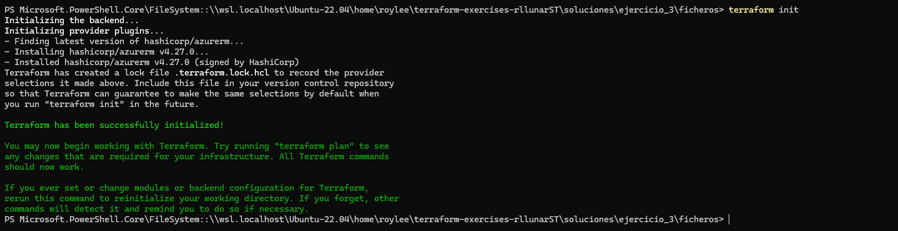
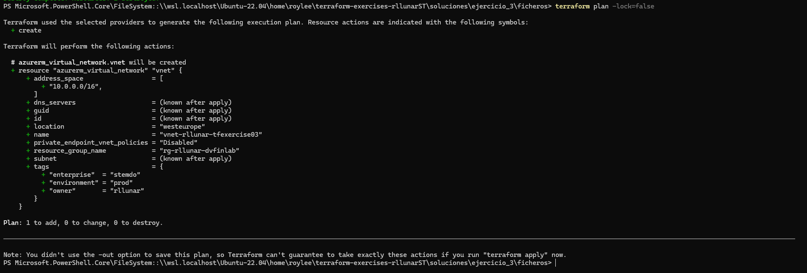
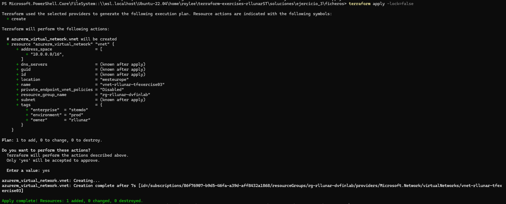
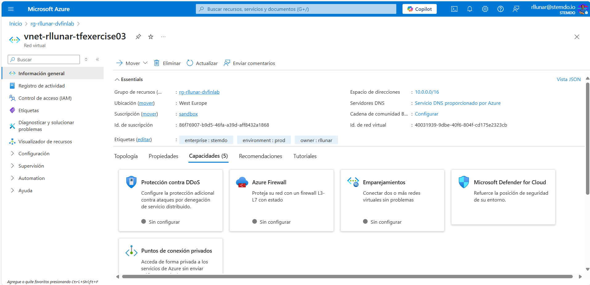
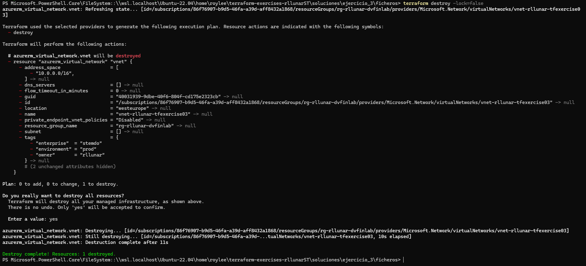

# Ejercicio 03

## Enunciado

Modifica el ejercicio anterior e incluye tres nuevas variables:

- `owner_tag`:
  - Tipo: `string`
  - Obligatoria.
  - Describe el propietario de la VNet.
- `environment_tag`:
  - Tipo: `string`
  - Obligatoria.
  - Describe el entorno de la VNet (`dev`, `test`, `prod`, etc).
- `vnet_tags`:
  - Tipo: `mapa de strings`
  - Opcional, siendo su valor por defecto un mapa vacío.
  - Describe los tags adicionales que se aplicarán a la VNet.

El módulo debe utilizar estas variables para formar los tags de la VNet, incluyendo los tags obligatorios `owner` y `environment` y los tags adicionales que se especifiquen en `vnet_tags`. Si en `vnet_tags` se especifica un tag con el mismo nombre que `owner` o `environment`, se debe sobreescribir el valor de estos últimos por el valor de `vnet_tags`.

Despliega el recurso en Azure utilizando el módulo desarrollado, documentando el proceso en el entregable.

Al finalizar el ejercicio, ejecuta el comando `terraform destroy` para eliminar todos los recursos creados y puedas empezar en el siguiente ejercicio sin conflictos de recursos preexistentes.

## Solucion

Para este ejercicio tome los ficheros de terraform de la actividad anterior y modifique el fichero `main.tf` para incluir las nuevas variables y su uso en la creación de la VNet. El resultado final es el siguiente:

```hcl
provider "azurerm" {
  features {}
}

resource "azurerm_virtual_network" "vnet" {
  name                = var.vnet_name
  location            = var.location
  resource_group_name = var.existent_resource_group_name
  address_space       = var.vnet_address_space

  tags = merge(
    {
      owner       = var.owner_tag
      environment = var.environment_tag
    },
    var.vnet_tags
  )
}
```

Lo que merge es fusionar 2 mapas en uno solo, en este caso el primero es el mapa de tags obligatorios y el segundo es el mapa de tags opcionales. Si en el segundo mapa hay alguna clave que ya existe en el primer mapa, se sobreescribirá el valor de esa clave por el segundo valor.

A su vez tambien modifique el fichero `variables.tf` para incluir las nuevas variables y su uso en la creación de la VNet. El resultado final es el siguiente:

```hcl
variable "existent_resource_group_name" {
  description = "Nombre del Resource Group ya existente en Azure"
  type        = string
}

variable "vnet_name" {
  description = "Nombre de la VNET a crear"
  type        = string
}

variable "vnet_address_space" {
  description = "Espacio de direcciones de la VNET"
  type        = list(string)
}

variable "location" {
  description = "Localización del despligue de la VNET"
  type        = string
  default     = "West Europe"
}

variable "owner_tag" {
  description = "Describe el propietario de la VNET"
  type        = string
}

variable "environment_tag" {
  description = "Describe el entorno de la VNET"
  type        = string
}

variable "vnet_tags" {
  description = "Etiquetas de la VNET"
  type        = map(string)
  default     = {}
}
```

En el fichero `terraform.tfvars` añadí tambien los valores que tendrán cada tag:

```hcl
existent_resource_group_name = "rg-rllunar-dvfinlab"
vnet_name                    = "vnet-rllunar-tfexercise01"
vnet_address_space           = ["10.0.0.0/16"]
owner_tag                   = "rllunar"
environment_tag            = "dev"
vnet_tags                   = {
  "enterprise" = "stemdo"
  "environment" = "prod"
}
```

Como podemos ver ahora en el fichero definimos en vnet-tags el tag `environment` con el valor `prod` esto hará que al desplegar la VNET el tag `environment` reemplace el valor `dev` por `prod`.

Ahora comenzaremos a desplegar la VNET.





Como podemos ver en la imagen la tags se han fusionado correctamente y la tag `environment` tiene el valor `prod` y no el valor `dev`, ahora aplicaremos el plan.



Ahora si nos dirigimos al portal de Azure y buscamos la VNET que hemos creado podemos ver que los tags se han aplicado correctamente.



Por ultimo eliminamos la VNET para evitar conflictos entre recursos.

