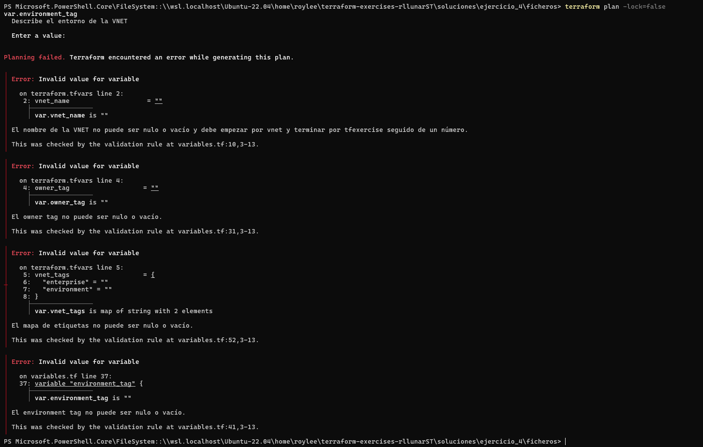
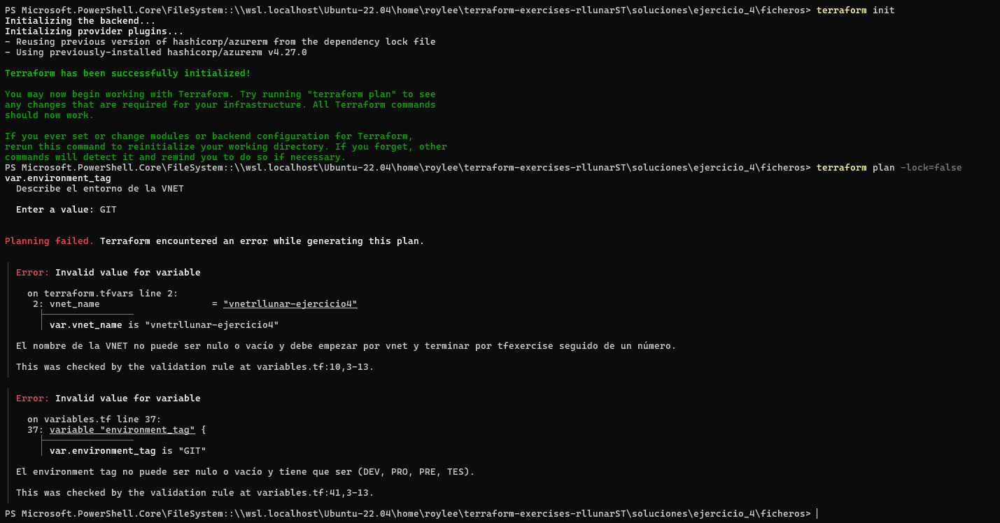
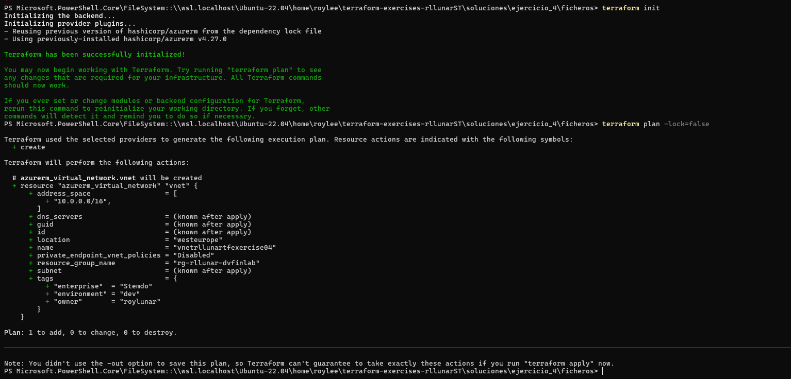
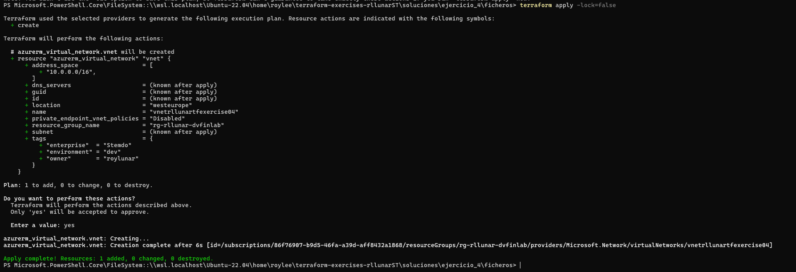
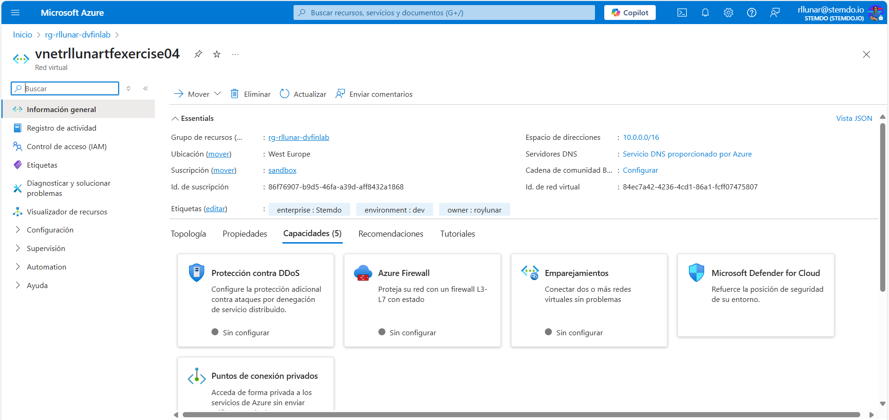
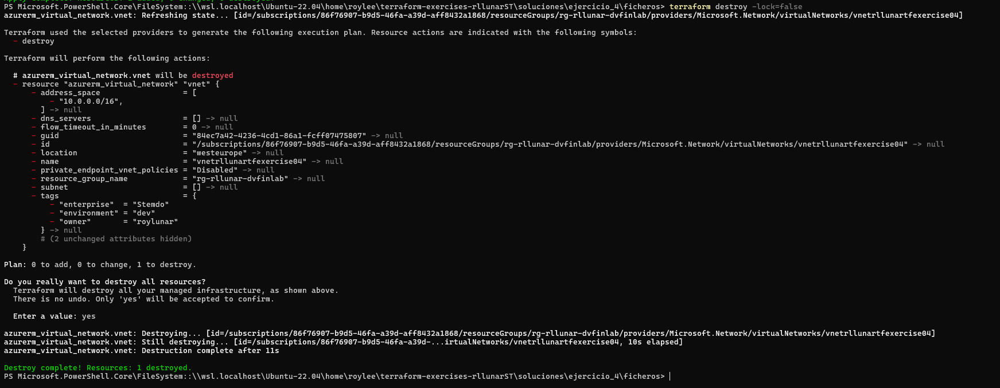

# Ejercicio 04

## Enunciado

Modifica el ejercicio anterior para que se cumplan las siguientes condiciones:

- `owner_tag`,`environment_tag` y `vnet_name` no pueden ser cadenas vacías ni ***nullable***.
- En `environment_tags`, los valores de los tags solo pueden contener uno de los siguientes valores, sin tener en cuenta mayúsculas o minúsculas (es decir, tanto 'dev', como 'DEv', como 'DEV' son valores aceptados): 'DEV', 'PRO', 'TES', 'PRE'.<br/>**Consejo:** Utiliza la función `contains` de Terraform en combinación con otras.
- `vnet_tags` no pueder null y además ninguno de los valores del mapa puede ser null o cadena vacía. 

- Al finalizar el ejercicio, ejecuta el comando `terraform destroy` para eliminar todos los recursos creados y puedas empezar en el siguiente ejercicio sin conflictos de recursos preexistentes.

Se debe elegir una de las siguientes opciones para validar la variable `vnet_name`:

### Opción 1 (Menor dificultad)

Debe cumplirse que comience siempre por `vnet`.

### Opción 2 (Mayor dificultad)

**Nota**: Esta opción está ideada para el uso de expresiones regulares.

Debe cumplirse que comience por `vnet` seguido de más de dos caracteres contenidos en el rango `[a-z]` y que termine por `tfexercise` seguido de al menos dos dígitos numéricos. Algunos ejemplos de valores aceptados y no aceptados serían:
  - `vnetprodrigueztfexercise01` -> Aceptado.
  - `vnetprodrigueztfexercise` -> No aceptado.
  - `vnetprodrigueztfexercise1` -> No aceptado.
  - `vnetpr0drigu3ztfexercise01` -> No aceptado.
  - `vnetprodrigueztfexercises01` -> No aceptado.
  - `vetprodrigueztfexercise01` -> No aceptado.
  - `vnetProdrigueztfexercise01` -> No aceptado.

## Solucion

Para este ejercicio tome los ficheros de terraform de la actividad anterior y modifique el fichero `variables.tf` para incluir las nuevas variables y su uso en la creación de la VNet. El resultado final es el siguiente:

```hcl
variable "existent_resource_group_name" {
  description = "Nombre del Resource Group ya existente en Azure"
  type        = string
}

variable "vnet_name" {
  description = "Nombre de la VNET a crear"
  nullable    = false
  type        = string
  validation {
    condition     = var.vnet_name != "" && can(regex("^vnet[a-z]{3,}tfexercise[0-9]{2,}$", var.vnet_name))
    error_message = "El nombre de la VNET no puede ser nulo o vacío y debe empezar por vnet y terminar por tfexercise seguido de un número."
  }
}

variable "vnet_address_space" {
  description = "Espacio de direcciones de la VNET"
  type        = list(string)
}

variable "location" {
  description = "Localización del despligue de la VNET"
  type        = string
  default     = "West Europe"
}

variable "owner_tag" {
  description = "Describe el propietario de la VNET"
  type        = string
  nullable    = false
  validation {
    condition = var.owner_tag != ""
    error_message = "El owner tag no puede ser nulo o vacío."
  }
}

variable "environment_tag" {
  description = "Describe el entorno de la VNET"
  type        = string
  nullable    = false
  validation {
    condition = var.environment_tag != "" && contains(["DEV", "PRO", "PRE", "TES"], upper(var.environment_tag))
    error_message = "El environment tag no puede ser nulo o vacío y tiene que ser (DEV, PRO, PRE, TES)."
  }
}

variable "vnet_tags" {
  description = "Etiquetas de la VNET"
  type        = map(string)
  nullable    = false
  default     = {}
  validation {
    condition     = alltrue([for val in values(var.vnet_tags) : val != ""])
    error_message = "El mapa de etiquetas no puede ser nulo o vacío."
  }
}
```

Como podemos ver las variables `owner_tag`, `environment_tag`, `vnet_tags` y `vnet_name` no pueden ser nulas o vacías, tambien observamos que la variable `environment_tag` solo puede contener los valores `DEV`, `PRO`, `PRE` o `TES` y por último la variable `vnet_name` tiene una validacion usando regex para comprobar que el nombre empieza por `vnet` y termina por `tfexercise` seguido de al menos dos dígitos numéricos.

Ahora probaremos introducir los valores vacios para comprobar que las validaciones funcionan correctamente. Para ello, ejecutamos el siguiente comando:

```bash
terraform init
terraform plan -lock=false
```

Y luego podemos ver en la siguiente imagen los errores que nos da terrraform a las validaciones que hicimos:



Si introducimos valores incorrectos podemos ver que terraform tambien nos da un error:



Si introducimos ahora valores correctos, terraform nos da el siguiente resultado:



Como podemos ver terraform pasa las validaciones y nos indica que esta listo para crear la VNet. Ahora si ejecutamos el siguiente comando:

```bash
terraform apply -lock=false
```

Podemos ver que terraform nos crea la VNet y los tags que le hemos pasado:



Una vez creada la VNet, podemos ver que se han creado los tags que le hemos pasado y la VNet con el nombre que le hemos dado:



Ahora eliminaremos la VNET que creamos anteriormente;

