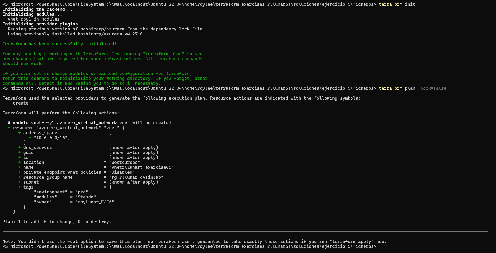
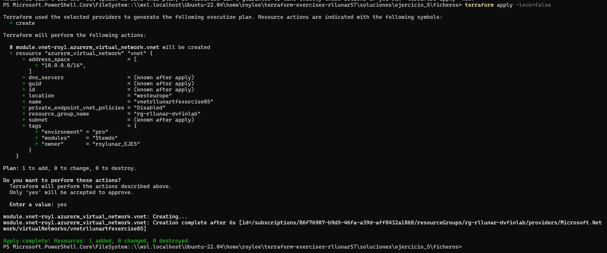
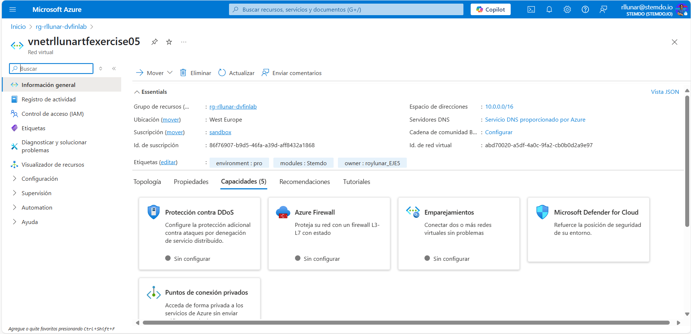
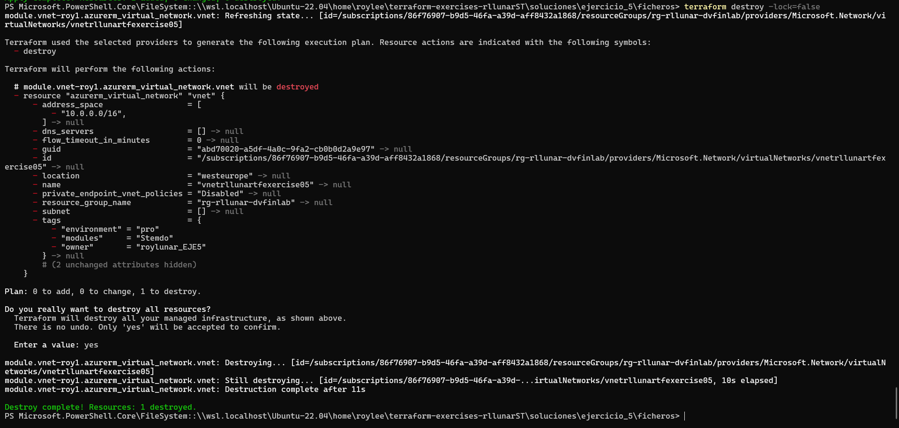

# Ejercicio 05

## Enunciado

Utilizando el contenido desarrollado durante los ejercicios anteriores, crea un módulo de terraform siguiendo la estructura recomendada por HashiCorp.

Una vez hecho esto, procede con los siguientes pasos:

Crea un nuevo módulo que disponga de un fichero `main.tf`. Añade también un fichero `variables.tf` para definir las variables de entrada, un fichero `outputs.tf` para definir las salidas y un fichero `terraform.tfvars` para definir los valores de las variables de entrada (reutiliza los valores del `ejercicio04`). Este módulo debe utilizar el módulo creado en el proceso anterior, que aún debe estar en local.

Al finalizar el ejercicio, ejecuta el comando `terraform destroy` para eliminar todos los recursos creados y puedas empezar en el siguiente ejercicio sin conflictos de recursos preexistentes.

**IMPORTANTE:** ¡Cuidado con exponer los valores sensibles!

- Documentación del proceso (con capturas de pantalla).
- Código de Terraform utilizado (como un directorio propio dentro del entregable).

## Solución

Para realizar este ejercicio crearemos una carpeta llamada `modules` dentro de la carpeta `ficheros` esta tendrá el contenido del ejercicio 4 y lo que respecta al ejercicio 5 se encontrará en  la raiz de la carpeta ficheros, simplemente en el fichero `ficheros/main.tf` importaremos el módulo creado en el ejercicio 4 de la siguiente forma:

```hcl
provider "azurerm" {
  features {}
}

module "vnet-roy1" {
  source = "../modules"

  vnet_name                    = var.vnet_name
  vnet_address_space           = var.vnet_address_space
  owner_tag                    = var.owner_tag
  environment_tag              = var.environment_tag
  existent_resource_group_name = var.existent_resource_group_name
  location                     = var.location
  vnet_tags                    = var.vnet_tags
}
```

Luego dentro de la carpeta `modules` crearemos el fichero `outputs.tf` que contendrá la siguiente salida:

```hcl
output "vnet_name" {
  description = "Nombre de la VNET creada"
  value       = azurerm_virtual_network.vnet.name
}

output "vnet_id" {
  description = "ID de la VNET creada"
  value       = azurerm_virtual_network.vnet.id
}

output "vnet_location" {
  description = "Localización de la VNET"
  value       = azurerm_virtual_network.vnet.location
}

output "vnet_address_space" {
  description = "Espacio de direcciones asignado a la VNET"
  value       = azurerm_virtual_network.vnet.address_space
}

output "vnet_resource_group" {
  description = "Nombre del Resource Group de la VNET"
  value       = azurerm_virtual_network.vnet.resource_group_name
}

output "vnet_tags" {
  description = "Etiquetas adicionales aplicadas a la VNET"
  value       = azurerm_virtual_network.vnet.tags
}
```

Ahora simplemente haremos un terraform init y un terraform plan para comprobar que todo funciona correctament.



Haremos ahora el terraform apply y veremos desde el portal de Azure que se ha creado la VNET con los tags y valores que le hemos pasado como variables de entrada.





Ahora eliminaremos la vnet que creamos con terraform destroy para evitar problemas en los siguiente ejercicios.

