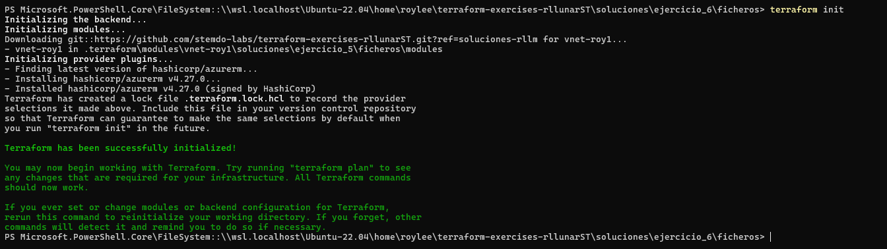

# Ejercicio 06

## Enunciado

Sube el módulo creado en el ejercicio anterior a un repositorio de GitHub (si se han seguido las instrucciones, ya debería estar localizado en la entrega del ejercicio previo).

Crea un nuevo fichero `main.tf` que haga uso del módulo localizado en el repositorio remoto.

Añade también un fichero `variables.tf` para definir las variables de entrada del módulo, un fichero `outputs.tf` para definir las salidas del módulo y un fichero `terraform.tfvars` para definir los valores de las variables de entrada (reutiliza todo lo que sea posible del ejercicio anterior).

Al finalizar el ejercicio, ejecuta el comando `terraform destroy` para eliminar todos los recursos creados y puedas empezar en el siguiente ejercicio sin conflictos de recursos preexistentes.

## Solución

Para este ejercicio tomare los fichero dentro de la carpeta `ficheros` del ejericicio 5 excepto la carpeta modules y modificaremos el fichero `main.tf` para que importe un modulo de forma remota con github, para esto lo que hare será poner mi repositorio de github publico para realizar la actividad y el fichero `main.tf` quedará de la siguiente forma:

```hcl
provider "azurerm" {
  features {}
}

module "vnet-roy1" {
  source = "git::https://github.com/stemdo-labs/terraform-exercises-rllunarST.git//soluciones/ejercicio_5/ficheros/modules?ref=soluciones-rllm"

  vnet_name                    = var.vnet_name
  vnet_address_space           = var.vnet_address_space
  owner_tag                    = var.owner_tag
  environment_tag              = var.environment_tag
  existent_resource_group_name = var.existent_resource_group_name
  location                     = var.location
  vnet_tags                    = var.vnet_tags
}
```

Ahora con esto cambiado lo unico que haremos será ejecutar el comando `terraform init` para inicializar el modulo:



Luego de esto ejecutamos el comando `terraform plan` para ver que todo este correcto y no haya errores:


Luego de esto ejecutamos el comando `terraform apply` para crear los recursos:


Ahora si nos dirigimos al portal de azure veremos que se creo los recursos sin problema:


Por ultimo eliminamos los recursos creados con el comando `terraform destroy`:

