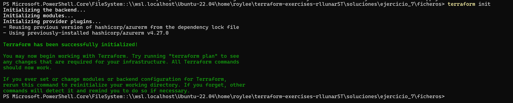
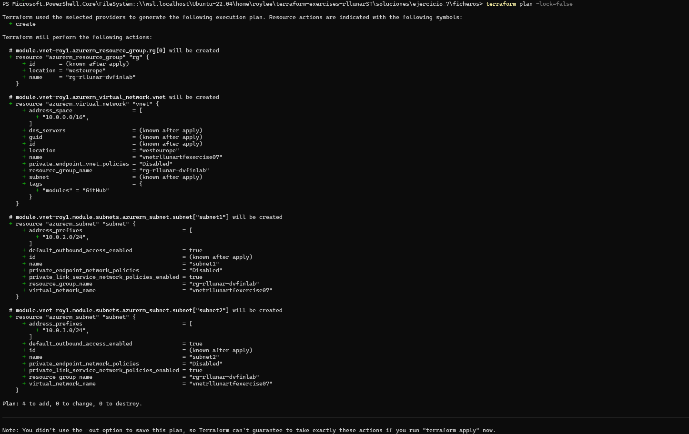
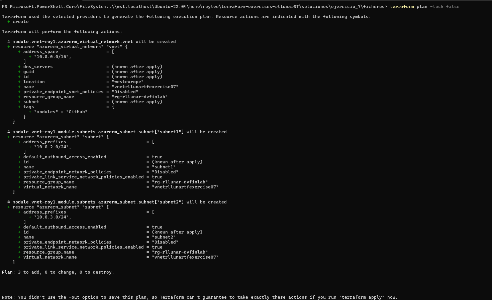
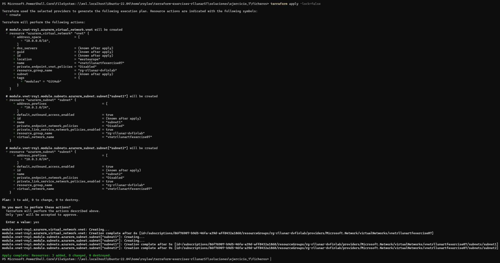
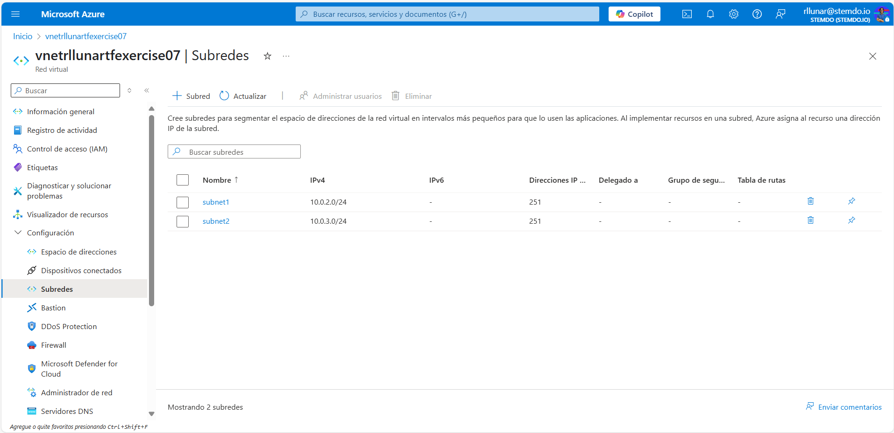
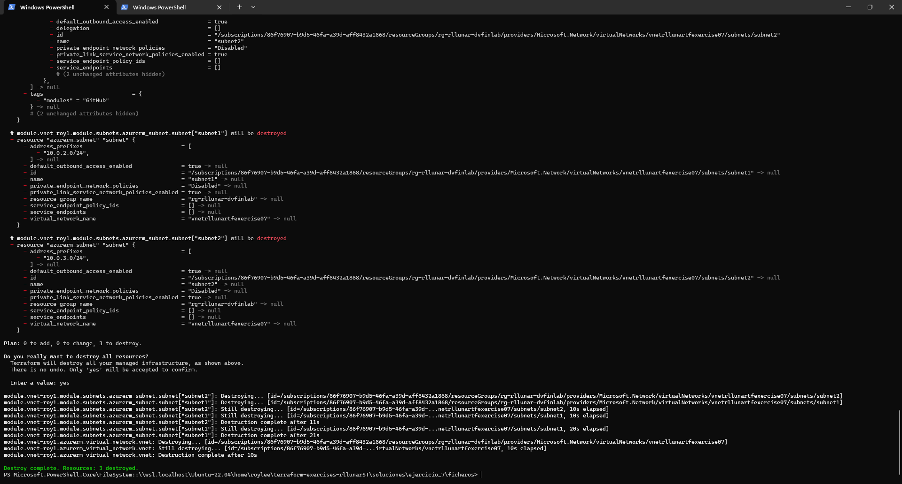

# Ejercicio 07

## Enunciado

Haciendo uso de las recomendaciones para la estructuración de módulos de Terraform definidas por HashiCorp, modifica el módulo creado a lo largo de los ejercicios anteriores para cumplir con los siguientes requisitos:

- El módulo debe ser capaz de crear:
  - Una VNet sobre un grupo de recursos existente o crear dicho grupo si no existe.
  - Cero o varias subnets dentro de la VNet. _(Utiliza módulos anidados para esto)_
  - **[¡¡OPCIONAL!!]** Cero o varios network security groups asociados a una o varias subnets. _(Utiliza módulos anidados para esto)_
- El módulo debe contener las validaciones que consideres necesarias para asegurar su correcto funcionamiento. <br/>**Nota:** Recuerda que los recursos de azurerm ya contienen validaciones por defecto que no son necesarias repetir, solo utiliza las validaciones que aporten valor para tu caso de uso.
- No es necesario definir todos los argumentos de los recursos proporcionados por azurerm, solo los **obligatorios** (es decir, en la documentación de azurerm, solo deben usarse los argumentos especificados como obligatorios bajo la sección *Argument Reference*).

Una vez completado el módulo, crea un ejemplo de uso que contenga la creación de una VNet con dos subnets.

Si se ha decidido desarrollar el apartado opcional, crea también un network security group asociado a una de las subnets anteriores. No es necesario que las reglas del network security group tenga sentido, simplemente añade reglas de ejemplo.

El ejemplo de uso puede constar de un solo fichero `main.tf` si se desea.

Al finalizar el ejercicio, ejecuta el comando `terraform destroy` para eliminar todos los recursos creados y puedas empezar en el siguiente ejercicio sin conflictos de recursos preexistentes.

## Solución

Para este ejercicio he creado una estructura de módulos que permite crear una VNet con subnets y opcionalmente asociar Network Security Groups a las subnets. La estructura de carpetas es la siguiente:

```
.
├── main.tf
├── terraform.tfvars
├── variables.tf
├── modules
│   ├── vnet
│   │   ├── main.tf
│   │   ├── variables.tf
│   │   ├── terraform.tfvars
│   │   ├── subnet
│   │   │   ├── main.tf
│   │   │   ├── variables.tf
│   │   │   └── terraform.tfvars
```

Como podemos ver la carpeta `modules` contiene el módulo `vnet` que a su vez contiene el módulo `subnet`. El módulo `vnet` es el encargado de crear la VNet y el grupo de recursos si se le indica, luego llama al módulo `subnet` para crear las subnets. El módulo `subnet` es el encargado de crear las subnets. Podemos ver que el contenido del fichero `.main.tf`:

```hcl
provider "azurerm" {
  features {}
}

module "vnet-roy1" {
  source                = "./modules/vnet"
  vnet_name             = var.vnet_name
  resource_group_name   = var.resource_group_name
  create_resource_group = var.create_resource_group
  location              = var.location
  owner_tag             = var.owner_tag
  address_space         = var.address_space

  tags = var.vnet_tags

  subnets = var.subnets
}
```

Luego tenemos el fichero `module/vnet/main.tf` que contiene la creacion del recurso de la vnet, el grupo de recursos y la llamada al módulo `subnet`:

```hcl
resource "azurerm_resource_group" "rg" {
  count    = var.create_resource_group ? 1 : 0
  name     = var.resource_group_name
  location = var.location
}

module "subnets" {
  source              = "./subnets"
  vnet_name           = var.vnet_name
  resource_group_name = var.resource_group_name
  virtual_network_name = azurerm_virtual_network.vnet.name
  subnets             = var.subnets
}

resource "azurerm_virtual_network" "vnet" {
  name                = var.vnet_name
  location            = var.location
  resource_group_name = var.create_resource_group ? azurerm_resource_group.rg[0].name : var.resource_group_name
  address_space       = var.address_space
  tags = var.tags
}
```

Ahora el fichero `module/vnet/subnets/main.tf` que contiene la creacion del recurso subnet:

```hcl
resource "azurerm_subnet" "subnet" {
  for_each = { for s in var.subnets : s.name => s }

  name                 = each.value.name
  resource_group_name  = var.resource_group_name
  virtual_network_name = var.virtual_network_name
  address_prefixes     = [each.value.address_prefix]
}
```

Como podemos ver el fichero raiz `main.tf` llama de forma directa al módulo `vnet` y le pasa los parámetros necesarios. El módulo `vnet` crea el grupo de recursos y la VNet, luego llama al módulo `subnet` que crea las subnets con los parametros necesarios que le pasamos desde el fichero terraform.tfvars desde la raiz siendo este fichero y el main el que reciba los valores y los mande al modulo `vnet` y este a su vez al módulo `subnet`. Ahora ejecutaremos el plan de terraform para ver si todo funciona correctamente:



Si indicamos en el fichero `terraform.tfvars` que queremos crear el grupo de recursos y la VNet, el resultado del plan será el siguiente:



Si no queremos crear el grupo de recursos y la VNet, el resultado del plan será el siguiente:



Ahora plicaremos este plan para crear la vnet y las subnets:



Ahora nos dirigiremos al portal de Azure y veremos que las subnets y la vnet se crearon correctamente:



Por ultimo eliminamos los recursos para evitar problemas:

