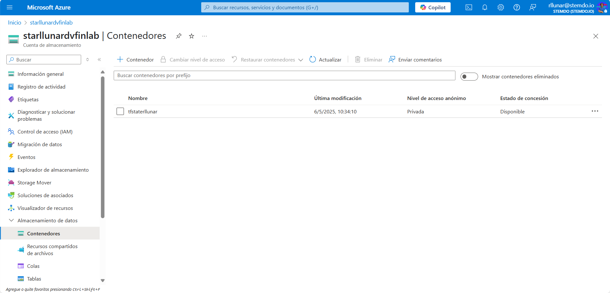

# Ejercicio 08

## Enunciado

Toma como base uno de los módulos desarrollados en ejercicios anteriores y configura el almacenamiento de estado remoto para Terraform en Azure Blob Storage.

Documenta los pasos necesarios para llevar a cabo el proceso con una breve explicación (en una línea) de cada uno; desde los cambios necesarios en azure, si los hubiera, hasta el resultado final tras la destrucción de la infraestructura.

Al finalizar el ejercicio, ejecuta el comando `terraform destroy` para eliminar todos los recursos creados y puedas empezar en el siguiente ejercicio sin conflictos de recursos preexistentes.

## Solucion 

Para realizar este ejercicio utilizamos el modulo del ejercicio 5, comenzamos la actividad iniciando sesion en Azure por consola para nuestro servicio principal:

```bash
az login --service-principal --username $Env:ARM_CLIENT_ID --password $Env:ARM_CLIENT_SECRET --tenant $Env:ARM_TENANT_ID
```


Ahora creamos el contenedor de almacenamiento y comprobamos que se haya creado de forma correcta, para ello ejecutamos los siguientes comandos: 

```bash
az storage container create --name tfstaterllunar --account-name starllunardvfinlab --auth-mode login
az storage container list --account-name starllunardvfinlab --auth-mode login --output table
```


Como podemos ver si nos dirigimos al portal de Azure vermeos el contenedor creado.



Una vez hagamos esto debemos crear el archivo `backend.tf` en la raiz del proyecto que tenga lo siguiente:

```hcl
terraform {
  backend "azurerm" {
    resource_group_name  = "rg-rllunar-dvfinlab"
    storage_account_name = "starllunardvfinlab"
    container_name       = "terraformstateRLLM"
    key                  = "dev.terraform.tfstate"
  }
}
```

Luego de esto debemos inicializar el backend remoto, para ello ejecutamos el siguiente comando:

```bash
terraform init
```


Ahora ejecutaremos el comando `terraform plan`:


Ahora ejecutaremos el comando `terraform apply`:


Luego veremos en el portal de Azure que se creo nuestra VNET sin problemas.


Por ultimo haremos un `terraform destroy` para evitar problemas futuros con los recursos:

