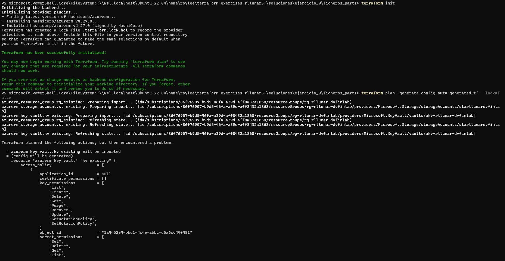
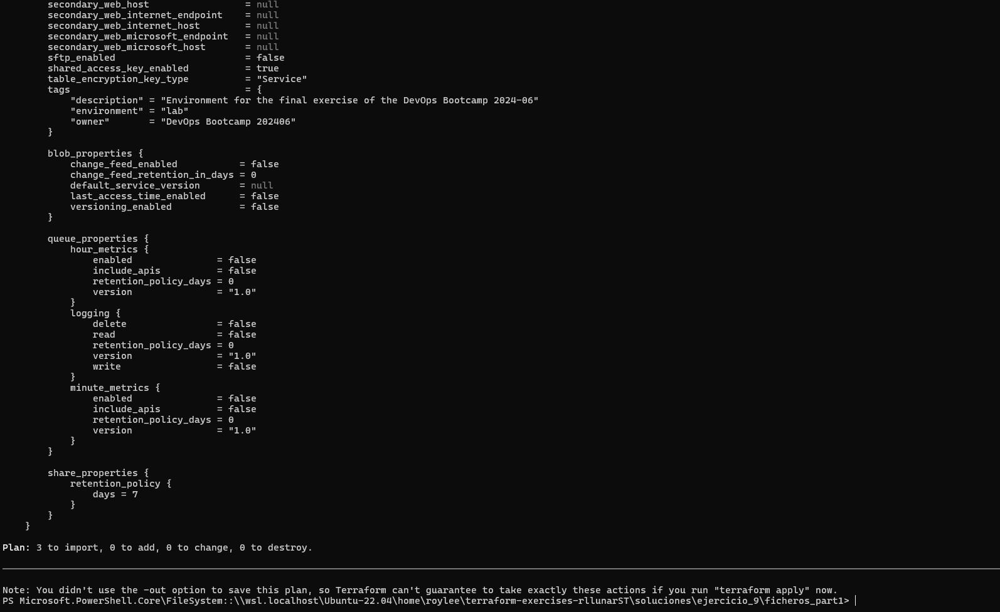
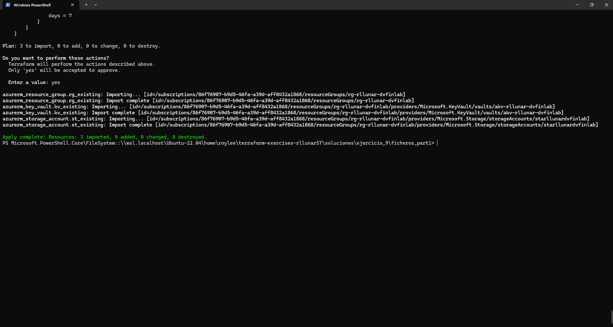
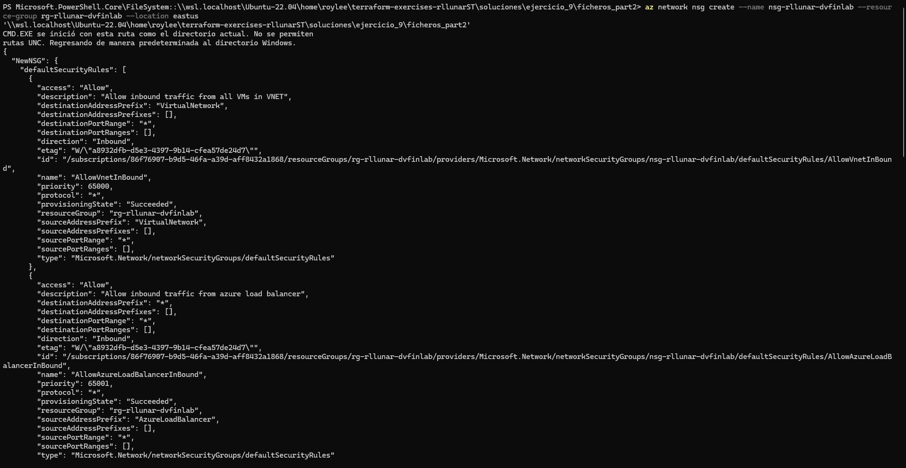
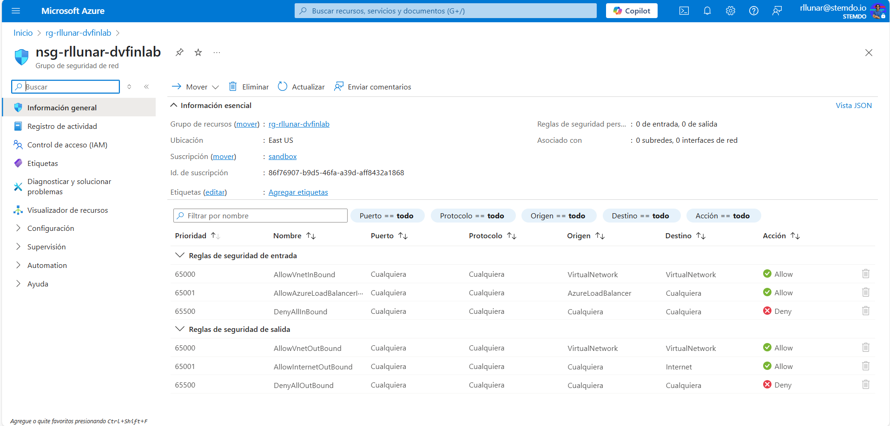
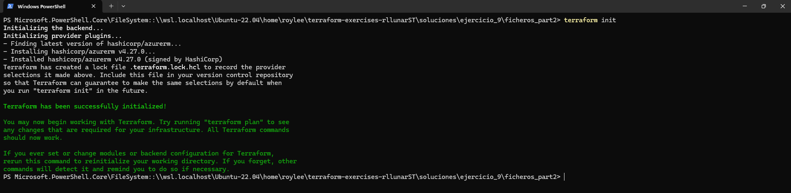
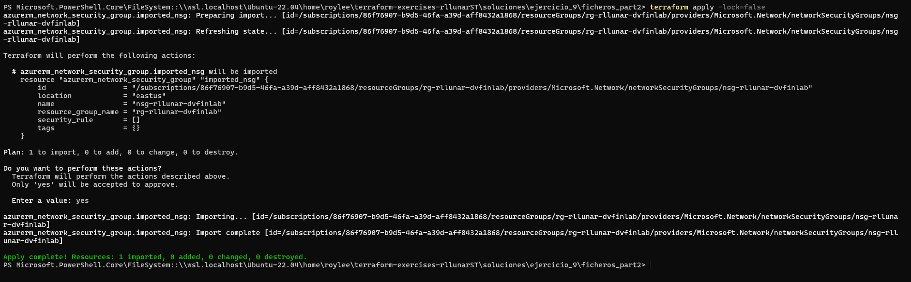
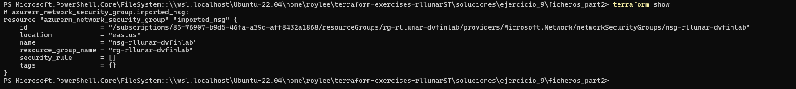
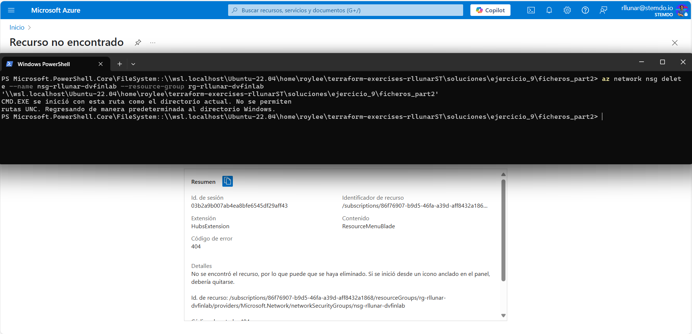
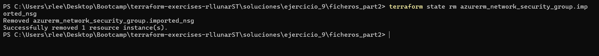

# Ejercicio 09

## Objetivos
El objetivo de este ejercicio es comprender el uso de terraform import y cómo afecta al tfstate en situaciones concretas. Se presentarán dos escenarios para explorar estos conceptos.

# Entregables

**IMPORTANTE:**
- Documentación del proceso (con capturas de pantalla).
- Código de Terraform utilizado (como un directorio propio dentro del entregable).
- Se adjuntará, un archivo respuestas.md, donde se escribirán las respuestas a las preguntas 

# Primera Parte: Importar Recursos Existentes en Azure.
En esta parte, trabajarás con recursos que ya existen en Azure pero que no están reflejados en el archivo de configuración de Terraform.

1. Añadir los bloques de terraform import en el archivo main.tf para los siguientes recursos:
        Azure Resource Group
        Azure Key Vault
        Azure Storage Account
    Nota: No definas los recursos explícitamente en Terraform, solo añade los bloques de importación necesarios.

2. Ejecutar terraform plan -generate-config-out="generated.tf"  (es posible que debas ajustar este comando) para generar el código de los  
   recursos.

3. Revisar el código generado en el archivo generated.tf. ¿Qué observas? ¿Es el código generado exactamente lo que esperabas?

4. Ejecutar los comandos terraform init, terraform plan y terraform apply

5. ¿Qué sucede cuando importas un recurso que ya existe en Azure pero no en el archivo de configuración de Terraform?

6. ¿Cómo afecta la importación al tfstate? ¿Qué diferencias observas en el estado después de aplicar los cambios?


# Segunda Parte: Manejar la Eliminación de un Recurso Externo
En esta parte, investigarás qué sucede con el tfstate si se elimina un recurso en Azure sin utilizar Terraform.

1. Crear manualmente un Network Security Group (NSG) en Azure a través del portal.

2. Añadir un bloque de terraform import en main.tf para importar el NSG al tfstate.

3. Ejecutar terraform show para verificar que el estado refleja correctamente el NSG y otros recursos.

4. Eliminar el NSG desde el portal de Azure.

5. Actualizar el tfstate para reflejar la eliminación del NSG. ¿Cómo podrías eliminar el recurso del tfstate?

6. Reflexiona sobre los bloques de importación en main.tf. ¿Es necesario mantenerlos una vez que el recurso ha sido eliminado?

7. ¿Qué sucede en el tfstate cuando eliminas un recurso en Azure sin utilizar Terraform?

8. ¿Cómo puedes asegurarte de que el tfstate refleja el estado real de tus recursos?

9. ¿Qué pasos adicionales son necesarios después de importar y  después de eliminar recursos?


## Importante
- Al finalizar el ejercicio, ejecuta el comando `terraform destroy` para eliminar todos los recursos creados.

## Enlaces de interés

- Documentación oficial: https://registry.terraform.io/

- Terraform import: https://developer.hashicorp.com/terraform/language/import/generating-configuration

- Terraform state rm: https://developer.hashicorp.com/terraform/cli/commands/state/rm

## Solucion: Parte 1

Para comenzar con la actividad 

para hacer este apartado crearemos un fichero main.tf que se encargará de incluir 3 bloques imports:

```hlc
provider "azurerm" {
  features {}
}

import {
  to = azurerm_resource_group.rg_existing
  id = "/subscriptions/86f76907-b9d5-46fa-a39d-aff8432a1868/resourceGroups/rg-rllunar-dvfinlab"
}

import {
  to = azurerm_key_vault.kv_existing
  id = "/subscriptions/86f76907-b9d5-46fa-a39d-aff8432a1868/resourceGroups/rg-rllunar-dvfinlab/providers/Microsoft.KeyVault/vaults/akv-rllunar-dvfinlab"
}

import {
  to = azurerm_storage_account.st_existing
  id = "/subscriptions/86f76907-b9d5-46fa-a39d-aff8432a1868/resourceGroups/rg-rllunar-dvfinlab/providers/Microsoft.Storage/storageAccounts/starllunardvfinlab"
}
```

Estos 3 bloques imports necesitan el Id de la suscripcion, el grupo de recursos, el key vault y el storageaccount para importarlos de forma correcta, una vez tengamos este fichero haremos un `terraform init` y un `terraform plan -generate-config-out="generated.tf"`:



Esto nos generará un fichero llamado `generated.tf` podremos ver que dentro del fichero tendremos la definicion de cada uno de los recursos importados en azure.

Ahora haremos un `terraform plan` y un `terraform apply`




## Solución: Parte 2

Para este apartado tendremos primero que iniciar sesion y acceder al servicio principal de Azure, para hacer esto utilizaremos el siguiente comando:

```bash
az login --service-principal --username $Env:ARM_CLIENT_ID --password $Env:ARM_CLIENT_SECRET --tenant $Env:ARM_TENANT_ID
```
Ahora crearemos un nuevo fichero `main.tf` este fichero tendrá el siguiente contenido:

```hlc
provider "azurerm" {
  features {}
}
 
import {
  to = azurerm_network_security_group.imported_nsg
  id = "/subscriptions/xxxxxxxx-xxxx-xxxx-xxxx-xxxxxxxxxxxx/resourceGroups/rg-rllunar-dvfinlab/providers/Microsoft.Network/networkSecurityGroups/nsg-rllunar-dvfinlab"
}
```

Con eso podremos importar el NSG existente en Azure a nuestro archivo de configuración de Terraform.

Crearemos de forma manual un NSG mediante comando ya que no poseemos los permisos suficiente para hacerlo asi que lo haremos por consola con el siguiente comando:

```bash
az network nsg create --name nsg-rllunar-dvfinlab --resource-group rg-rllunar-dvfinlab --location eastus
```



Podremos ver ahora que en el portal de Azure tenemos el recurso NSG creado:



Ahora que ya tenemos creado el NSG haremos uso del comando `terraform init` para iniciar el directorio.

```bash
terraform init
```



Ahora lanzaremos el comando `terraform plan -generate-config-out="generated.tf"` para generar la definición del recurso NSG que creamos.

```bash
terraform plan -generate-config-out="generated.tf"
```


Ahora usaremos el comando `terraform apply` y aplicamos el plan que nos generó terraform al generar el fichero `generated.tf`:



Ahora usaremos el comando `terraform show` este comando nos permitirá comprobar que el fichero `terraform.tfstate` refleja correctamente el NSG en Azure y muchos otros recursos:



Para eliminar el NSG nos ocurre lo mismo que cuando creamos el NSG ya que no poseemos permisos suficientes asi que eliminaremos el NSG por linea de comandos:

```bash
az network nsg delete --name nsg-rllunar-dvfinlab --resource-group rg-rllunar-dvfinlab
```



Como podemos ver el NSG ya no se encuentran en el portal de Azure y se elimina sin problemas.

Ahora lo que haremos será actualizar el tfstate para reflejar la eliminación del NSG, esto lo haremos con el siguiente comando:

```bash
terraform state rm azurerm_network_security_group.imported_nsg
```



Y ya con esto habriamos finalizado todo lo que el ejercicio pide sin problemas.